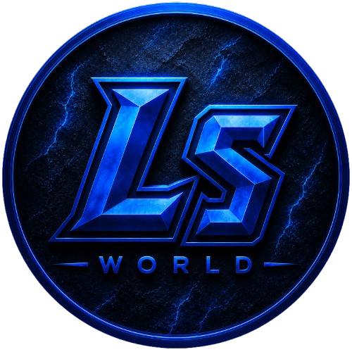

  
  <h1>LS World Roleplay</h1>
  
Documentation officielle complète de LS World : règlement HRP, global, légal, illégal et guides de connexion.

  

    <a class="ls-btn primary" href="reglement-global/">📘 Règlement global</a>
    <a class="ls-btn" href="reglement-illegal/reglement-illegal/">🔫 Règlement illégal</a>
    <a class="ls-btn" href="guide/se-connecter/">🚀 Se connecter</a>
  

## Navigation rapide

<a class="tile" href="reglement-hrp/"><h3>💬 Règlement HRP</h3>
Comportement, tickets, Discord, stream et règles hors roleplay.
</a>
<a class="tile" href="reglement-global/"><h3>💻 Règlement Global</h3>
Bases RP, règles générales, services publics et zones safes.
</a>
<a class="tile" href="reglement-legal/"><h3>👮 Règlement RP Légal</h3>
LSPD, BCSO, EMS, gouvernement, entreprises et activités légales.
</a>
<a class="tile" href="reglement-illegal/"><h3>🔫 Règlement RP Illégal</h3>
Organisations, braquages, gunfight, drogues, rançons et îles.
</a>

## Principes LS World

RP sérieux avant tout

LS World est orienté roleplay sérieux. Les scènes doivent rester cohérentes, justifiées et jouées jusqu'au bout.

Le fair-play prime sur la victoire

Le but n'est pas de gagner chaque scène, mais de créer des interactions propres, équilibrées et mémorables.

Le staff tranche les litiges

En cas de problème, terminez la scène, notez les informations utiles, puis ouvrez un ticket.

